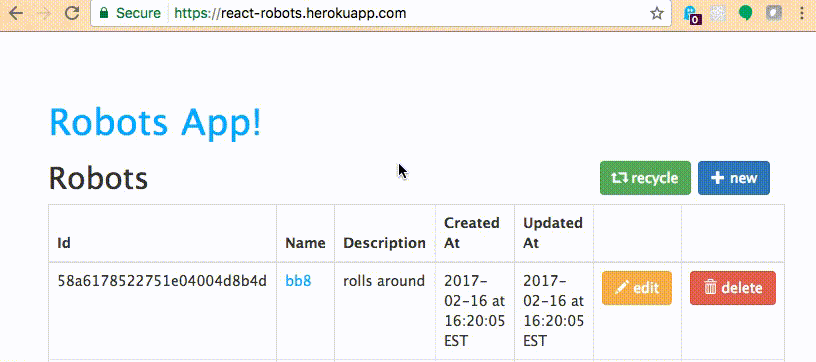

# CRUD Application Checkpoint III: Interactivity

Use a front-end development framework to add placeholder alerts and other interactive features to your CRUD Application.

## Objectives

  1. Practice using jQuery and Twitter Bootstrap JavaScript plugins to add interactive features to a web page.
  1. Learn how to use JavaScript to listen for and respond to click events.

## Prerequisites

  1. [CRUD Application Checkpoint II: Style](projects/crud-application/checkpoints/style/checkpoint.md)
  * [Personal Website Checkpoint III: Interactivity](projects/personal-website/checkpoints/Interactivity/checkpoint.md)

## Accompanying Materials

  + [Project Repository](#TODO_______)
  + [Commit History](#TODO_______)
  + [Live Demo](#TODO_______)

## Instructions

Continue development of your CRUD Application by adding interactive features. Namely, the only features you need to implement are logging and alerts. Reference the alert functionality of https://react-robots.herokuapp.com/.

## Logging

For each non-link button you see (e.g. "Recycle", "Edit", and "Delete"), when that button is clicked, log a descriptive message to the console to indicate which button has been clicked. Don't worry if these buttons aren't really doing anything at the moment. By listening for button clicks, we are preparing to implement their true functionality later in the semester.

## Alerts

For each non-link button you see (e.g. "Recycle", "Edit", and "Delete"), when that button is clicked, display a "flash-message" alert at the top of the page. Use placeholder text for now like "RECYCLED ALL THE ROBOTS", "EDITED ROBOT #XXXX" and "DELETED ROBOT #XXXXX". Ensure each alert contains an "X" button that when clicked makes the alert disappear. Again, don't worry that the buttons aren't doing what the alert is saying.
