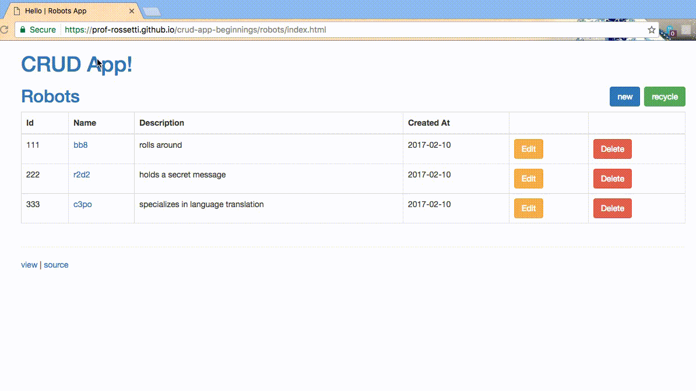

# CRUD Application Checkpoint II: Style

Use a front-end development framework to establish the preliminary structure and style for your CRUD Application.

## Objectives

  1. Practice using a front-end web development framework.
  * Practice responsive web site design.
  * Practice HTML and CSS.
  * Use version control to revert to previous repository versions.

Prerequisites

  1. [CRUD Application Checkpoint I: Structure](/projects/crud-application/checkpoints/style/checkpoint.md)
  1. [Personal Website Checkpoint II: Style](/projects/personal-website/checkpoints/style/checkpoint.md)

## Instructions

Create from scratch a web site that mimics the structure and style of https://prof-rossetti.github.io/crud-app-beginnings/robots. Don't worry about the home page of that site. Just focus on the `/robots` pages.



### Review

For step-by-step guidance, see that project's [commit history](https://github.com/prof-rossetti/crud-app-beginnings/commits/master). For each commit, click its link to view file changes and browser screenshots.

Sequence | Commit Message | Commit Identifier
--- | --- | ---
1 | Create a new web page | 0676136
2 | Install twitter bootstrap | 5815818
3 | Add a table | 6947a23
4 | Style the table | edb342a
5 | Stop using placeholder content | fd2d2da
6 | Use placeholder links | de7b654
7 | Initial commit | a91b5c8
8 | Configure remote repository | e635eb1
9 | Merge branch 'master' of github.com:prof-rossetti/crud-app-beginnings | 3aa9ffe
10 | Add links to remote repository | 80ab2d2
11 | Add self-referential homepage link | 995d526
12 | Add links to robot show pages | ceec412
13 | Move robots table to robots index, replace home page content | ef65f94
14 | Convert absolute links to relative links to try to work around GitHub Pages routing errors | d1a7709
15 | Add links to live site | 1800aa2
16 | Apply consistent design and navigation to bb8 show page | fbc3c99
17 | Apply consistent design and navigation to remaining show pages | 93f8e8e
18 | Specify robot identifier in a heading | 615cad1
19 | Use links that look like buttons to navigate to the new page from all other pages | 66b53e5
20 | Add form to new page | 455e997

### Replay

For a truly immersive experience, step through each of the commits to review the source code and preview the results in a browser.

#### Setup

First clone the repository to your local machine and navigate to it.

```` sh
git clone git@github.com:prof-rossetti/crud-app-beginnings.git
cd crud-app-beginnings/
````

In a new terminal window or tab, start a local web server:

```` sh
# Mac Terminal:
python -m SimpleHTTPServer 8888

# Windows Command Prompt:
python –m http.server 8888
````

Visit the site at http://localhost:8888/robots/.

#### Step-by-step

Start your step-by-step review by reverting to the first commit.

```` sh
git checkout 0676136 # both the long version of the commit's identifier (e.g. 067613652e924e984561c0b07ffb98bb7ac26c7c) and the short version (e.g. 0676136) can be used to reference the first commit. Reference the commit list and show pages on GitHub, or your local `git log` results to find the commit identifiers.
````

Don't worry if you see a warning about being on a 'detached HEAD' state.

Refresh the browser to see what the site looked like back at that version. Study the source code at that version by viewing the files in your text editor.

Repeat this process for each commit until you reach the last one.

When you are finished, revert back to the most recent version (i.e. that of the current "master" branch) and your repository will no longer be in a 'detached HEAD' state:

```` sh
git checkout master
````

Congratulations, you are starting to utilize the full power of version control!
